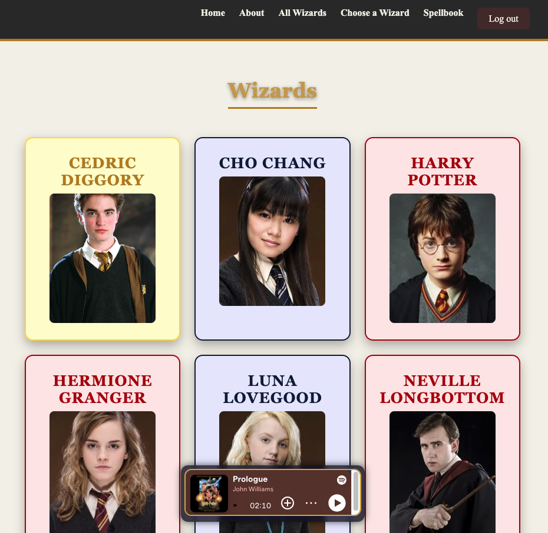

### Application Name: *Ollivander's Exchange*

### Description
Ollivanders Exchange is a Harry Potter–inspired Django application where users can create and customize their own Wizards. Each Wizard has a detailed profile card, allowing users to seamlessly add, update, or remove wands. Wizards can also expand their magical abilities by learning new spells through a many-to-many relationship. Inspired by a love for the Wizarding World, this application immerses users in a Hogwarts-like experience where their imagination brings the magic to life. 

### Deployed App: 
[Enter the Wizarding World](https://ollivanders-exchange-dcb5920511b9.herokuapp.com/)

*Planning Materials*
[Trello](https://trello.com/b/AREV37wY/ollivanders-exchange)

### Technologies Used and Attributions
* [ChatGPT](https://www.chatgpt.com) - for coding guidance, troubleshooting, and helped with CSS guidance.
* [API-help](https://dev.to/yahaya_hk/how-to-populate-your-database-with-data-from-an-external-api-in-django-398i) - for guidance on importing an API into the application
* [HarryPotter-API](https://hp-api.onrender.com/) - Harry Potter API used for characters and spells
* Python
* Django

### Next Steps
* As a user, I want to see all the Wizards who know a specific spell so that I can discover wizards who share the same abilities
* As a user I want to search for wizards by name, house or spell knowledge.
